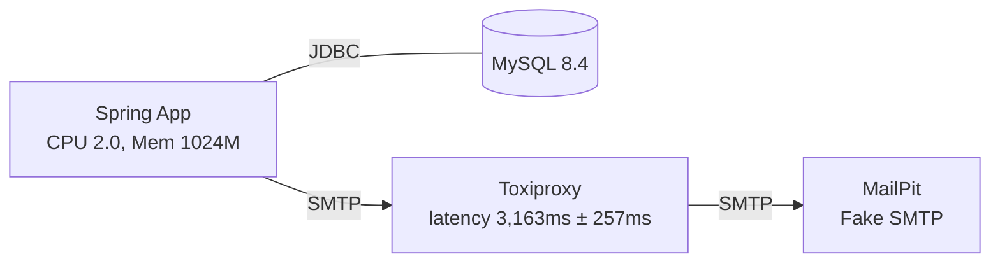
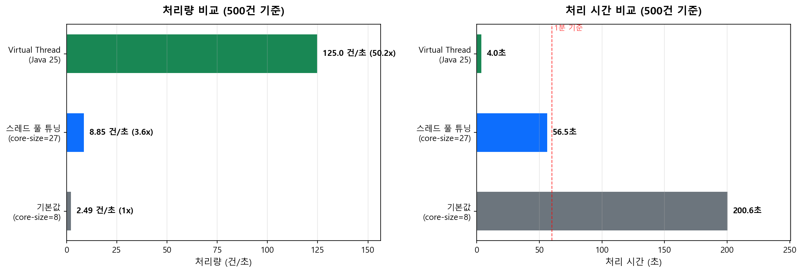

# 서론

## 서비스 소개

RecycleStudy 서비스는 복습하고 싶은 URL 링크를 저장하면 주기적으로 복습 내용을 이메일로 전송해주는 서비스입니다. 사용자가 직접 복습 주기를 커스텀하여 원하는 주기와 시간대에 이메일을 받을 수 있는
기능을 제공하고 있습니다.

## 성능 테스트를 시작한 배경

성능 테스트는 서비스를 운영하면서 "현재 구조로는 어느 정도의 트래픽을 수용할 수 있을까?"하는 고민에서 시작하였습니다. 현재 상황을 정확하게 파악해야 문제가 될 수 있는 지점을 빠르게 식별하고 가장 적합한 해결
방안을 도출할 수 있기 때문입니다.

# 1. 목표 정의

성능 테스트의 모호한 목표를 명확하게 만들기 위해 목표를 아래와 같이 재정의하였습니다.

> 현재 아키텍처의 병목 지점을 측정하여 식별하고 측정 근거를 바탕으로 개선한다.

성능 테스트의 의의는 “어디서 병목이 생기는가?”를 찾는 것이 핵심이고 그 결과를 바탕으로 “어떻게 개선할 것인가?”로 연결하는 과정이라고 보았기 때문입니다.

# 2. 성능 테스트 계획 설정

## 2-1. 인프라 제약 확인

성능 테스트 계획을 위해 현재 사용하고 있는 인프라의 제약을 정리하였습니다.
성능 테스트의 기준은 인프라 제약과 서비스 목표에서 역산하는 것이 목표 성능 산정에 용이하다고 생각했기 때문입니다.
현재 인프라에서 최대 몇 명까지 서비스 가능한지를 먼저 계산하고 그 한계를 테스트로 검증한 뒤에 사용자가 N명으로 늘어나면 어디가 먼저 병목이 되는지를 찾는 과정을 수행하였습니다.

현재 사용하고 있는 인프라 제약은 아래 표와 같습니다.

| 구성 요소      | 스펙                                  | 제약                  |
|------------|-------------------------------------|---------------------|
| Nginx      | t4g.nano (2 vCPU, 0.5GB RAM), 직접 설치 | 리버스 프록시 역할          |
| Spring 서버  | t4g.micro (2 vCPU, 1GB RAM), Docker | JVM 힙 크기 제한         |
| MySQL      | t4g.micro (2 vCPU, 1GB RAM), 직접 설치  | 커넥션 수, 메모리 제한       |
| Gmail SMTP | 무료                                  | 일일 100건, 시간당 권장 20건 |

이 중 가장 큰 제약은 "Gmail 일일 100건"입니다. 그러면 현재 인프라에서 최대 몇 명까지 서비스가 가능한지가 궁금했습니다. 이를 알려면 사용자 1명이 하루에 이메일을 몇 건 발생시키는지부터 계산해야 합니다.

## 2-2. 사용자 시나리오와 용량 산정

사용자 1명이 하루에 발생시키는 이메일 수를 계산하기 위해 먼저 사용자 시나리오를 정의하였습니다.

| 항목                | 값                             | 근거           |
|-------------------|-------------------------------|--------------|
| 1인당 하루 URL 등록     | 1~2개 (평균 1.5개)                | 실사용 패턴 기반    |
| 활동 시간대            | 18:00~24:00 (6시간)             | 퇴근 후 학습 시간대  |
| 복습 주기             | 에빙하우스 (10분, 1시간, 1일, 7일, 30일) | 기본 주기        |
| notification_time | 설정됨 (예: 20:00)                | 1일 이상 주기에 적용 |

이 서비스의 이메일 발송에는 그룹핑 규칙이 존재합니다. 같은 사용자에게 같은 `scheduledAt` 시각에 여러 복습 건이 있으면 1개의 이메일로 그룹핑됩니다. 그리고 복습 주기에 따라 `scheduledAt`이
결정되는 방식이 다릅니다.

- 10분, 1시간 주기: `notification_time` 미적용 → URL 등록 시점 기준으로 발송
- 1일, 7일, 30일 주기: `notification_time` 적용 → 사용자가 설정한 시각에 발송

이 규칙을 기반으로 하루에 URL 2개를 서로 다른 시각에 등록하는 사용자의 일일 이메일 수를 계산하면 다음과 같습니다.

| 발송 시점                     | 내용                                      | 이메일 수 | 설명                   |
|---------------------------|-----------------------------------------|-------|----------------------|
| 등록 후 10분 (URL 1)          | URL 1의 10분 복습                           | 1건    |                      |
| 등록 후 10분 (URL 2)          | URL 2의 10분 복습                           | 1건    | 다른 시각에 등록 → 별도 발송    |
| 등록 후 1시간 (URL 1)          | URL 1의 1시간 복습                           | 1건    |                      |
| 등록 후 1시간 (URL 2)          | URL 2의 1시간 복습                           | 1건    | 다른 시각에 등록 → 별도 발송    |
| notification_time (20:00) | 어제의 1일 복습 + 7일 전의 7일 복습 + 30일 전의 30일 복습 | 1건    | 같은 scheduledAt으로 그룹핑 |

단기(10분, 1시간) 4건 + 장기(notification_time) 1건 = 5건/일/사용자입니다.

이제 2-1에서 확인한 Gmail 제약에 이 수치를 대입하여 DAU를 계산하였습니다.

| 인프라               | 한도        | 1인당 5건 기준 DAU |
|-------------------|-----------|---------------|
| Gmail SMTP        | 일 100건    | ~20명          |
| AWS SES (무료, EC2) | 월 62,000건 | ~400명         |

현재 Gmail 환경에서의 운영 한계는 DAU 20명입니다. 그런데 DAU 20명 수준으로 성능 테스트를 수행하면 애플리케이션에 유의미한 부하가 발생하지 않아 병목을 발견할 수 없습니다. 따라서 Gmail SMTP
제약을 제거한 애플리케이션 자체의 처리 한계를 찾는 것이 성능 테스트의 방향이 되어야 한다고 보았습니다.

## 2-3. 부하 지점 분리

이 서비스는 매분 스케줄러가 실행되어 scheduledAt이 현재 시각과 일치하는 리뷰를 조회합니다. 같은 사용자의 리뷰를 1개의 이메일로 그룹핑하여 발송하는 구조입니다.

이 구조에서 부하가 발생하는 지점은 API 요청과 스케줄러 발송 두 가지이며 성격이 다릅니다.

|     | API 부하 (Review 등록) | 스케줄러 부하 (이메일 발송)         |
|-----|--------------------|--------------------------|
| 트리거 | 사용자의 HTTP 요청       | 매분 `@Scheduled` 자동 실행    |
| 패턴  | 산발적, 예측 불가         | 주기적, 예측 가능               |
| 병목  | DB 쓰기, 커넥션 풀       | SMTP I/O, DB 읽기, 비동기 스레드 |

여기서 "동시 사용자"와 "DAU"는 다른 개념입니다. 동시 사용자는 같은 순간에 API를 호출하는 수이고 DAU는 하루 동안 서비스를 이용하는 총 사용자 수입니다. API 부하는 동시 사용자 기준이고 스케줄러
부하는 DAU 기준으로 발생합니다.

API 쪽의 평균 TPS를 계산하면 다음과 같습니다.

```
DAU 500명 기준
- 1인당 하루 평균 URL 등록 1.5회
- 하루 총 요청 750건
- 활동 시간대: 18:00~24:00 (6시간 = 21,600초)
- 평균 TPS: 750 / 21,600 ≈ 0.035
```

즉, API TPS가 0.035로 매우 낮습니다. 이 서비스에서 실질적으로 의미 있는 성능 지표는 'API TPS'가 아니라 '스케줄러의 분당 처리 능력'이라는 것을 알 수 있었습니다.

## 2-4. 스케줄러의 핵심 시나리오: notification_time 스파이크

스케줄러의 최대 부하는 모든 사용자의 `notification_time`이 같은 분에 집중될 때 발생합니다.

```
DAU 500명, 전원 notification_time = 20:00 설정 시:

20:00 스케줄러 실행:
  - 어제의 1일 복습 + 7일 전의 7일 복습 + 30일 전의 30일 복습
  - 500명 × 1건(그룹핑됨) = 500건의 이메일을 1분 내에 발송해야 함

단기 복습(10분, 1시간)은 18:00~24:00에 분산:
  - 500명 × 4건 / 360분 = 5.6건/분
```

스케줄러는 매분 실행되므로 현재 분의 발송이 다음 분 실행 전에 완료되어야 합니다. 완료되지 않으면 발송이 누적되어 지연이 발생합니다. 따라서 "1분 이내 처리 완료"를 핵심 기준으로 설정하였습니다.

이 기준을 바탕으로 부하 레벨을 정의하였습니다.

| 레벨 | 동시 발송 이메일 수 | 의미 (DAU 환산) | 목적                   |
|----|-------------|-------------|----------------------|
| 1  | 50건         | ~50 DAU     | 기준선 측정               |
| 2  | 200건        | ~200 DAU    | 부하 증가 시 처리량 선형성 확인   |
| 3  | 500건        | ~500 DAU    | 목표 DAU의 스파이크 시나리오 검증 |

# 3. 테스트 환경 구축

## 3-1. SMTP 모킹 전략

2-2에서 Gmail 환경의 운영 한계가 DAU 20명이라는 것을 확인하였습니다. 실제 Gmail SMTP를 사용하면 일일 100건 제한으로 의미 있는 부하 테스트가 불가능하고 대량 발송 시 계정 차단이나 스팸 분류
위험도 있습니다. 따라서 SMTP를 모킹하되 실제 Gmail과 유사한 응답 시간을 재현해야 테스트 결과에 신뢰성이 확보됩니다.

위 문제를 해결하기 위해 모킹 방식을 비교하였습니다.

| 방식                 | 설명                                | 신뢰성 | 한계                          |
|--------------------|-----------------------------------|-----|-----------------------------|
| Service 레이어 Mock   | `EmailSender`를 no-op으로 교체         | 낮음  | SMTP I/O 시간이 0이 되어 실제와 불일치  |
| Fake SMTP 서버       | GreenMail, MailPit 등 로컬 SMTP      | 중간  | SMTP 프로토콜은 유지하지만 네트워크 지연 없음 |
| Fake SMTP + 인위적 지연 | Fake SMTP에 실제 Gmail 응답 시간만큼 지연 추가 | 높음  | 지연 시간 추정의 정확성에 의존           |

실제 SMTP 응답 시간을 재현하면서도 대량 발송이 가능한 세 번째 방식을 선택하였습니다. Toxiproxy를 사용하면 애플리케이션과 SMTP 서버 사이에서 네트워크 레벨로 지연을 주입할 수 있으며 비즈니스 로직을
변경할 필요가 없다는 장점 때문이었습니다.

```
Spring App -> Toxiproxy (지연 주입) -> MailPit (Fake SMTP)
```

## 3-2. Gmail SMTP 응답 시간 실측

모킹에 적용할 지연 시간의 근거를 확보하기 위해 실제 Gmail SMTP로 15건을 발송하여 응답 시간을 측정하였습니다. 아래는 측정 시간 통계 지표를 정리한 표입니다.

| 지표     | 값        |
|--------|----------|
| Median | 3,163 ms |
| Stdev  | 257 ms   |
| Min    | 2,641 ms |
| Max    | 3,832 ms |

이 측정값을 Toxiproxy의 latency toxic에 적용하였습니다. latency 3,163ms, jitter 257ms로 설정하여 실제 Gmail과 유사한 응답 시간을 재현하였습니다.

## 3-3. 테스트 환경 구성

실제 배포 환경(AWS EC2 t4g.micro)을 시뮬레이션하기 위해 Docker Compose로 로컬에 테스트 환경을 구성하였습니다. 이 테스트의 목적은 절대적인 성능 수치를 측정하는 것이 아니라 병목 지점을
식별하고 개선 전후의 상대적 효과를 비교하는 것이므로 동일한 환경에서 일관되게 측정할 수 있다면 로컬 환경으로도 충분하다고 판단하였습니다.

| 컨테이너      | 역할             | 비고                      |
|-----------|----------------|-------------------------|
| Spring    | 애플리케이션         | CPU 2.0, Memory 1024M   |
| MySQL 8.4 | 테스트 전용 DB      |                         |
| MailPit   | Fake SMTP 서버   |                         |
| Toxiproxy | SMTP 지연 주입 프록시 | latency 3,163ms ± 257ms |



> Toxiproxy는 이후 4-2에서 발견된 측정 오류로 인해 모킹 객체인 `DelayEmailSender` 구현으로 교체되었습니다.

Spring App에 CPU 2.0 cores, Memory 1024M 제한을 걸고 JVM 옵션으로 `-XX:MaxRAMPercentage=50.0`을 설정하여 프로덕션의 t4g.micro 환경을 재현하였습니다.
컨테이너 환경에서는 cgroup으로 메모리를 제한하지만 JVM의 기본 힙 크기 계산이 할당된 메모리보다 클 수 있어 OOM Kill이 발생할 수 있습니다. `-XX:MaxRAMPercentage=50.0`을 설정하면
컨테이너에 할당된 메모리의 50%를 힙으로 제한하고 나머지를 메타스페이스, 스레드 스택, GC 등에 할당합니다.

# 4. 기준선 측정과 측정 도구의 문제 발견

## 4-1. 첫 측정 결과

테스트 환경을 구축한 뒤 레벨 1~3까지 스케줄러 부하 테스트를 실행하였습니다.

| 레벨 | 건수  | 처리 시간  | 처리량 (건/초) | 성공률  | 1분 초과    |
|----|-----|--------|-----------|------|----------|
| 1  | 50  | 143초   | 0.35      | 100% | 2.4배 초과  |
| 2  | 200 | 518초   | 0.39      | 100% | 8.6배 초과  |
| 3  | 500 | 1,291초 | 0.39      | 100% | 21.5배 초과 |

모든 레벨에서 처리량이 ~0.39건/초로 일정하였습니다. 50건조차 1분을 초과하는 결과였습니다.

## 4-2. Toxiproxy 측정 오류 발견

그런데 이론적으로 계산하면 결과가 맞지 않았습니다. `@Async` 스레드 풀 core-size가 8이고 이메일 1건당 3.2초라면 처리량은 8 / 3.2 = 2.5건/초가 되어야 합니다. 측정 결과인
0.39건/초는 이론값의 1/6 수준이었습니다.

원인을 조사한 결과, Toxiproxy의 latency toxic이 SMTP 세션 단위가 아니라 패킷 단위로 지연을 주입한다는 것을 발견하였습니다. SMTP 프로토콜은 하나의 이메일 발송에 약 7번의 라운드 트립(
EHLO, AUTH, MAIL FROM, RCPT TO, DATA, 본문, QUIT)이 발생합니다. 각 패킷마다 3,163ms가 추가되면 1건당 약 22초가 소요됩니다.

```
실제 Gmail: 1건당 ~3.2초 (세션 전체)
Toxiproxy:  1건당 ~22초 (7 라운드 트립 × 3,163ms)
```

8 스레드 / 22초 = 0.36건/초로 실측 0.39건/초와 일치하였습니다. 측정 도구의 동작 방식이 실제 환경과 달라 잘못된 측정이 이루어지고 있었습니다.

## 4-3. DelayEmailSender로 재측정

Toxiproxy의 패킷 단위 지연 문제를 해결하기 위해 `DelayEmailSender`를 구현하였습니다. `EmailSender`를 상속하여 `Thread.sleep(3163ms ± 257ms)`으로 세션 단위의
정확한 지연을 재현할 수 있습니다. `@Profile("perftest") @Primary`로 설정하여 성능 테스트 환경에서만 활성화되도록 하였습니다.

```java

@Component
@Profile("perftest")
@Primary
public class DelayEmailSender extends EmailSender {

    private final long delayMs;
    private final long jitterMs;

    // delayMs=3163, jitterMs=257 (Gmail SMTP 실측 기반)

    @Override
    public void send(final Email targetEmail, final String subject, final String content) {
        try {
            final long actualDelay = delayMs + ThreadLocalRandom.current().nextLong(-jitterMs, jitterMs + 1);
            Thread.sleep(actualDelay);
        } catch (final InterruptedException e) {
            Thread.currentThread().interrupt();
            throw new EmailSendException("메일 전송 시뮬레이션 중 인터럽트 발생", e);
        }
    }
}
```

`EmailSender`의 `send()` 메서드를 오버라이드하여 실제 SMTP 통신 대신 `Thread.sleep()`으로 동일한 지연 시간만 발생시킵니다. 실제 이메일은 발송하지 않으므로 Gmail 일일 제한에
영향을 주지 않으면서 SMTP I/O 대기 시간을 정확히 재현합니다. 3-1에서 Service 레이어 Mock 방식을 "SMTP I/O 시간이 0이 되어 실제와 불일치"한다는 이유로 신뢰성이 낮다고 평가했지만 실제
지연을 추가하면 네트워크 레벨 프록시보다 SMTP 세션 단위의 지연을 더 정확하게 재현할 수 있었습니다.

재측정 결과는 다음과 같습니다.

| 레벨 | 건수  | 처리 시간  | 처리량 (건/초) | 성공률  | 1분 초과   |
|----|-----|--------|-----------|------|---------|
| 1  | 50  | 20.3초  | 2.47      | 100% | 미초과     |
| 2  | 200 | 79.3초  | 2.52      | 100% | 1.3배 초과 |
| 3  | 500 | 200.6초 | 2.49      | 100% | 3.3배 초과 |

Toxiproxy 대비 약 7배 빠른 결과가 나왔고 이는 Toxiproxy의 7 라운드 트립 증폭 효과가 제거된 것과 일치합니다. 처리량은 ~2.5건/초이며 1분 기준으로 최대 약 150건 처리가 가능합니다. 즉
현재 구조의 한계는 DAU 150명입니다.

# 5. 병목 분석

기준선 측정에서 처리량이 ~2.5건/초로 확인되었습니다. 이 수치가 어디서 결정되는지 원인을 코드에서 분석하였습니다.

애플리케이션의 `@EnableAsync` 설정에 커스텀 `ThreadPoolTaskExecutor`가 없었습니다. 이 경우 Spring Boot는 `TaskExecutionAutoConfiguration`을 통해
기본 `ThreadPoolTaskExecutor`를 생성합니다.

이때 스레드 풀의 기본값은 `TaskExecutionProperties`에 정의되어 있습니다.

```java
// org.springframework.boot.autoconfigure.task.TaskExecutionProperties.Pool
public static class Pool {

    private int coreSize = 8;
    private int maxSize = Integer.MAX_VALUE;
    private int queueCapacity = Integer.MAX_VALUE;
    // ...
}
```

`core-size`의 기본값이 8이므로 커스텀 설정 없이 `@Async`를 사용하면 최대 8개의 스레드만 동시에 작업을 수행합니다. 이론값을 계산하면 8 스레드 / 3.163초(이메일 1건) =
2.53건/초입니다. 실측 ~2.5건/초는 이론값과 1~2% 이내의 차이를 보이며 이는 태스크 간 오버헤드(DB 저장, 큐 pickup 등)에 의한 것으로 이론 모델과 일치합니다. 처리량이 스레드 수에 비례하는
패턴을 보이므로 병목이 `@Async` 스레드 풀 core-size=8에 있다고 판단하였습니다.

# 6. 개선 1: 플랫폼 스레드 풀 튜닝

병목이 스레드 수에 있으므로 `spring.task.execution.pool.core-size` 값을 늘려 처리량을 개선하기로 하였습니다. 프로덕션 환경이 2 vCPU인데 스레드를 8개 이상으로 늘리는 것이 의미가
있는지 의문이 들 수 있습니다. 그러나 이메일 발송은 SMTP I/O 대기가 대부분(3.2초)을 차지하는 I/O 바운드 작업입니다. CPU 바운드 작업이라면 코어 수 이상의 스레드는 컨텍스트 스위칭 오버헤드만
증가시키지만 I/O 바운드 작업에서는 스레드가 I/O를 대기하는 동안 CPU가 유휴 상태이므로 코어 수보다 많은 스레드를 수용할 수 있습니다. 따라서 core-size 설정을 위해 목표 DAU에서 필요한
core-size를 역산하였습니다.

역산 공식: `core-size = (분당 목표 건수 / 60) * 3.163초`

## 테스트 1: core-size=11 (목표 DAU 200)

| 건수  | 처리 시간 | 처리량 (건/초) | 성공률  | 1분 이내 |
|-----|-------|-----------|------|-------|
| 200 | 55.7초 | 3.59      | 100% | 달성    |

## 테스트 2: core-size=27 (목표 DAU 500)

| 건수  | 처리 시간 | 처리량 (건/초) | 성공률  | 1분 이내 |
|-----|-------|-----------|------|-------|
| 500 | 56.5초 | 8.85      | 100% | 달성    |

## 기본값 대비 개선 효과 (500건 기준)

두 목표 모두 1분 이내 처리를 달성하는 것을 확인하였습니다.

| 설정           | 처리 시간   | 처리량     | 1분 이내   |
|--------------|---------|---------|---------|
| core-size=8  | 200.6초  | 2.49건/초 | 3.3배 초과 |
| core-size=27 | 56.5초   | 8.85건/초 | 달성      |
| 개선 배율        | 3.6배 단축 | 3.6배 향상 |         |

# 7. 개선 2: Virtual Thread

플랫폼 스레드 풀 튜닝은 목표 DAU마다 core-size를 계산하고 조정해야 합니다. Java 21에서 도입된 Virtual Thread는 이러한 수동 튜닝 없이 동시성을 확보할 수 있는 방법입니다. Virtual
Thread는 JVM이 관리하는 경량 스레드로 캐리어 스레드(OS 스레드와 일대일 매칭되는 스레드)에 다대일로 매핑됩니다. I/O 블로킹이 발생하면 해당 Virtual Thread는 캐리어 스레드에서
unmount되고 캐리어 스레드는 다른 Virtual Thread의 작업을 처리할 수 있습니다. 이메일 발송은 건당 3.2초의 SMTP I/O 대기가 발생하므로 Virtual Thread를 적용하면 수백 개의 발송
작업이 소수의 캐리어 스레드 위에서 동시에 I/O 대기를 수행할 수 있어 처리량이 크게 향상될 것으로 예상하였습니다.

## 7-1. Virtual Thread 적용 시 고려사항

그런데 Virtual Thread에는 pinning이라는 문제가 있습니다. `synchronized` 블록 안에서 블로킹 I/O를 수행하면 Virtual Thread가 캐리어 스레드에서 분리되지 못하고 고정됩니다.
이 경우 플랫폼 스레드와 동일하게 동작하여 Virtual Thread의 이점이 사라집니다. Jakarta Mail의 `SMTPTransport.sendMessage()`에서 `synchronized`가 적용되어 있어
메서드 내부에서 Socket I/O를 수행하는 pinning 문제가 발생한다는 것을 확인할 수 있었습니다. Spring Boot의
이슈([#38883](https://github.com/spring-projects/spring-boot/issues/38883))에서도 이메일 3건 발송 시 pinning이 59건 발생하는 것이 보고되었습니다.

Jakarta Mail의 `SMTPTransport` 클래스에서 해당 부분을 확인할 수 있습니다.

```java
// com.sun.mail.smtp.SMTPTransport
public synchronized void sendMessage(Message msg, Address[] addresses)
        throws MessagingException, SendFailedException {
    // ... 내부에서 Socket I/O를 통해 SMTP 서버와 통신
}
```

메서드 시그니처에 `synchronized`가 선언되어 있고 내부에서 Socket을 통한 SMTP 통신을 수행합니다. Virtual Thread가 이 메서드를 실행하면 `synchronized` 락을 잡은 상태에서
I/O 블로킹이 발생하여 캐리어 스레드에서 unmount되지 못합니다. 따라서 Java 21 환경에서 `spring.threads.virtual.enabled=true`만 설정하는 것으로는 Virtual
Thread의 이점을 얻을 수 없습니다.

## 7-2. JEP 491 (Java 24~)

JEP 491은 Java의 `synchronized` 구현을 변경하여 `synchronized` 블록 내에서도 Virtual Thread가 캐리어 스레드에서 unmount될 수 있도록 합니다. 기존에는
`synchronized` 진입 시 OS 수준의 모니터를 사용했기 때문에 Virtual Thread가 모니터를 잡은 상태에서 블로킹되면 캐리어 스레드까지 함께 블로킹되었습니다. JEP 491은 이 모니터 구현을
Java 객체 수준으로 재구현하여 Virtual Thread가 모니터를 보유한 채로도 캐리어 스레드에서 unmount될 수 있게 합니다. 이 변경은 JVM 런타임 수준의 개선이므로 Jakarta Mail 등의
라이브러리를 수정할 필요 없이 JVM을 업그레이드하는 것만으로 pinning 문제가 해결됩니다. JEP 491은 바이트코드가 아닌 JVM 런타임의 모니터 구현 변경이므로 Java 21로 컴파일한 바이트코드를 차세대
LTS 버전인 Java 25 JVM에서 그대로 실행할 수 있습니다.

프로덕션 코드베이스가 Java 21 기반이고 Java 25의 새로운 언어 기능을 사용할 필요가 없으므로 Virtual Thread 기반 성능 테스트를 수행하기 위해 컴파일 환경은 유지하고 런타임만 교체하는 전략을
선택하였습니다. Dockerfile에 `amazoncorretto:25-alpine` 이미지를 적용하여 기존 JAR을 실행하도록 구성하였습니다.

## 7-3. 테스트 결과

테스트 조건:

- JVM: Amazon Corretto 25
- 설정: `spring.threads.virtual.enabled=true`
- SMTP 시뮬레이션: `DelayEmailSender` (`Thread.sleep(3163ms ± 257ms)`)

| 건수  | 처리 시간 | 처리량 (건/초) | 성공률  | 1분 이내 |
|-----|-------|-----------|------|-------|
| 500 | 4.0초  | 125.0     | 100% | 달성    |

Virtual Thread가 500개 생성되어 동시에 `Thread.sleep()`을 실행하므로 ~3.2초 후 거의 동시에 sleep이 완료되고 이후 DB 저장이 수행되어 총 4.0초가 소요된 결과입니다.

## 7-4. 전체 결과 비교 (500건 기준):

| 방식                     | JVM     | 처리 시간  | 처리량     | 배율    |
|------------------------|---------|--------|---------|-------|
| 플랫폼 스레드 (core-size=8)  | Java 21 | 200.6초 | 2.49건/초 | 1x    |
| 플랫폼 스레드 (core-size=27) | Java 21 | 56.5초  | 8.85건/초 | 3.6x  |
| Virtual Thread         | Java 25 | 4.0초   | 125건/초  | 50.2x |

> 주의사항: 이 결과는 `DelayEmailSender`(`Thread.sleep`) 기반입니다. 실제 SMTP 환경에서는 Java 21의 경우 `SMTPTransport.sendMessage()`의
> pinning으로 VT 이점이 없으며 JEP 491이 적용된 Java 24 이상 버전의 환경에서만 Virtual Thread 이점이 유효합니다.

# 8. 추가 분석: DB 커넥션 풀

스레드 풀 튜닝으로 core-size를 27로 늘렸고 Virtual Thread에서는 500개의 작업이 동시에 실행됩니다. 동시에 실행되는 스레드가 증가하면 DB에 동시 접근하는 스레드도 늘어나므로 HikariCP의
기본 `maximumPoolSize=10`이 병목이 될 수 있습니다. 이를 확인하기 위해 커넥션 사용 패턴을 분석하였습니다.

이메일 발송 흐름에서 DB 커넥션 사용 패턴을 코드에서 추적하였습니다.

```
SingleReviewEmailSender.sendOne()         ← @Async, @Transactional 없음
  ├─ emailSender.send()                   ← 3.2초 (DB 커넥션 불필요)
  └─ notificationHistoryService.updateStatus() ← @Transactional (여기서만 커넥션 사용)
```

`sendOne()` 메서드에 `@Transactional`이 없으므로 이메일 전송 중(3.2초)에는 DB 커넥션을 점유하지 않습니다. `updateStatus()` 호출 시에만 커넥션을 짧게 사용합니다.
커넥션 보유 시간 ~15ms는 이후 VT 테스트 결과(오버헤드 800ms ÷ 50라운드 ≈ 16ms)로부터 역산한 값입니다.

테스트 결과와 대조하면 다음과 같습니다.

| 방식                  | 이론값   | 실측    | DB 병목 여부           |
|---------------------|-------|-------|--------------------|
| core-size=27 (500건) | 58.6초 | 56.5초 | 병목 아님 (이론값 이하)     |
| VT (500건)           | ~3.2초 | 4.0초  | ~0.8초 오버헤드 (허용 범위) |

core-size=27에서는 실측이 이론값보다 빨라 커넥션 10개로 충분합니다. VT 환경에서는 500건이 동시에 `updateStatus()`을 호출하지만 10개 커넥션으로 50라운드 × 15ms = 0.75초 오버헤드가
발생하며 이는 실측 0.8초 오버헤드와 일치합니다. 따라서 현재 규모에서 HikariCP 기본 10개는 병목이 아닙니다.

# 9. 결론

## 전체 결과 요약

DAU ~500 스파이크 시나리오인 500건 동시 발송 기준으로 세 가지 방식의 처리 성능을 비교한 결과입니다.
병목이었던 `@Async` 스레드 풀 core-size를 튜닝하면 3.6배, Virtual Thread를 적용하면 50.2배의 처리량 향상을 확인하였습니다.

| 방식                       | 처리 시간  | 처리량     | 1분 이내   | 배율    |
|--------------------------|--------|---------|---------|-------|
| 기본값 (core-size=8)        | 200.6초 | 2.49건/초 | 3.3배 초과 | 1x    |
| 스레드 풀 튜닝 (core-size=27)  | 56.5초  | 8.85건/초 | 달성      | 3.6x  |
| Virtual Thread (Java 25) | 4.0초   | 125건/초  | 달성      | 50.2x |



## 목표 트래픽과 프로덕션 적용 검토

이 서비스의 목표 DAU를 ~500명으로 설정하였습니다. 근거는 두 가지입니다.

- AWS SES 무료 한도인 “EC2 발송 시 월 62,000건”에서 역산하면 62,000 / 30일 / 5건 = 약 400명이 추가 비용 없이 운영 가능한 상한입니다.
- 코드 변경 없이 core-size 튜닝만으로 1분 내 처리가 가능한 최대 규모가 DAU ~500입니다.

현재 Gmail 환경(DAU ~20)에서 목표 DAU ~500까지 도달하기 위한 단계별 적용 계획은 다음과 같습니다.

| 단계  | 조건              | 변경 사항                                               | 처리 능력       |
|-----|-----------------|-----------------------------------------------------|-------------|
| 현재  | Gmail (DAU ~20) | 변경 없음                                               | 150건/분      |
| 1단계 | SES 전환 시        | SMTP 설정 변경 + `core-size=27`                         | 500건/분      |
| 2단계 | DAU 500 초과 시    | `spring.threads.virtual.enabled=true` + Java 24+ 적용 | 7,500건/분 이상 |

1단계(SES + core-size 튜닝)만으로 목표 DAU ~500을 달성할 수 있으며 Virtual Thread는 그 이상의 성장이 필요한 시점에 적용하면 됩니다.

## 이 과정에서 얻은 교훈

- 이론값 계산, 실측, 불일치 시 원인 분석의 반복이 성능 테스트의 핵심입니다.
  Toxiproxy 오류 발견(4장), 스레드 풀 병목 분석(5장), DB 커넥션 풀 분석(8장) 모두 이론값과 실측값을 대조하여 원인을 추적하는 동일한 사이클을 반복하여 얻은 결과입니다.
- 측정 도구의 동작 방식을 반드시 검증해야 합니다.
  Toxiproxy의 패킷 단위 지연 특성을 사전에 파악하지 못해 잘못된 기준선(0.39건/초)으로 분석하는 문제가 발생했습니다. 측정 결과가 이론값과 맞지 않으면 여러 측면에서 원인을 검토해야 합니다.
- 스레드 풀 튜닝 시 작업의 특성을 파악해야 합니다.
  I/O 바운드 작업에서는 CPU 코어 수보다 많은 스레드가 유효합니다. "2 vCPU이므로 스레드는 2~4개가 적절하다"는 CPU 바운드 기준의 판단이며 I/O 바운드 작업에서는 적용되지 않습니다.
- Virtual Thread 적용 시 pinning 여부를 반드시 확인해야 합니다.
  Jakarta Mail의 `synchronized` + Socket I/O 패턴은 Java 21에서 pinning이 발생합니다. JEP 491이 적용된 24 버전 이상 Java에서 이를 해결하지만 JVM 버전
  요구사항을 사전에 파악해야 합니다.
