# Recycle Study Server - 시나리오별 시퀀스 다이어그램

## 공통 구조

- **인증 방식**: `X-device-Id` 헤더로 디바이스 식별자 전달 → `DeviceAuthArgumentResolver`가 DB 조회 후 활성화 여부 검증
- **이메일 발송**: `@Async` 비동기 처리
- **입출력 레이어**: Controller ↔ Service 간 Input/Output DTO 분리

---

## 1. 회원/디바이스 등록

`POST /api/v1/members`

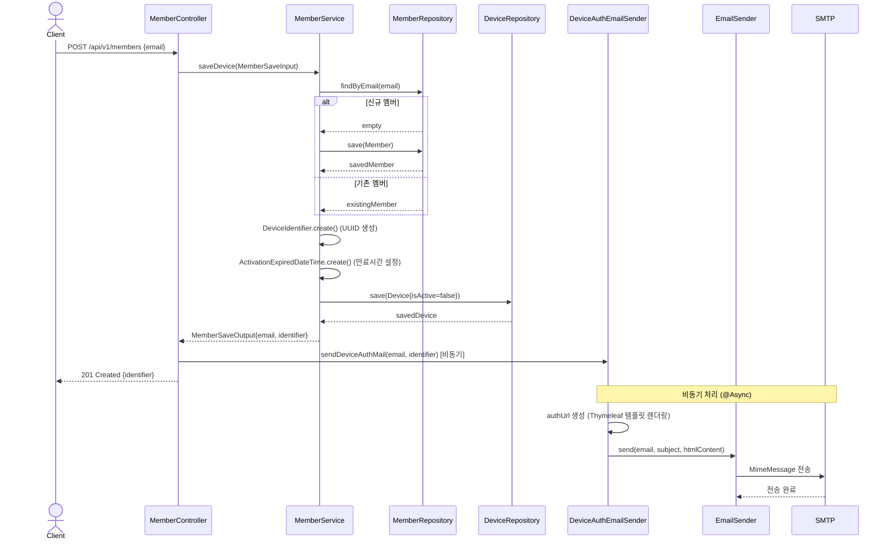

---

## 2. 디바이스 인증 (이메일 링크 클릭)

`GET /api/v1/device/auth?email={email}&identifier={identifier}`

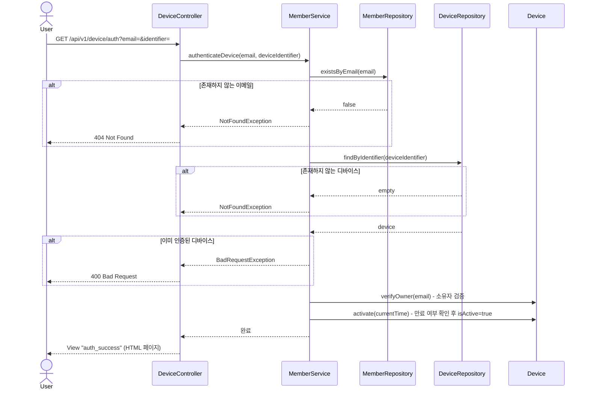

---

## 3. 디바이스 목록 조회

`GET /api/v1/members`

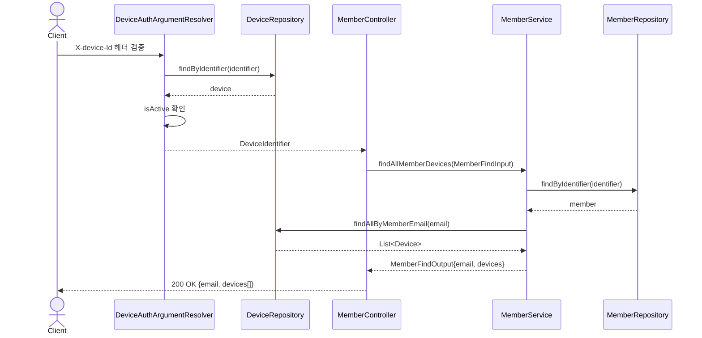

---

## 4. 알림 시간 조회

`GET /api/v1/members/notification-time`

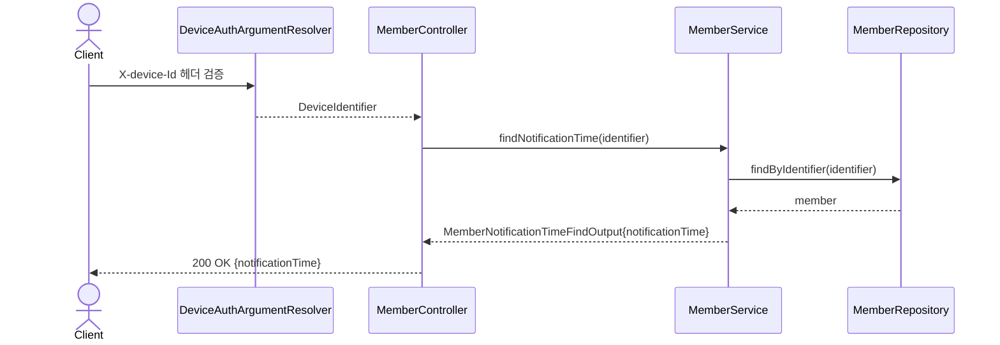

---

## 5. 알림 시간 수정

`PATCH /api/v1/members/notification-time`

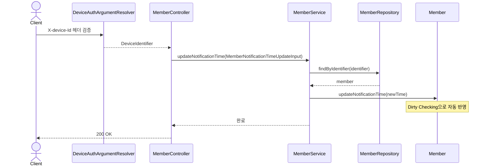

---

## 6. 디바이스 삭제

`DELETE /api/v1/device`

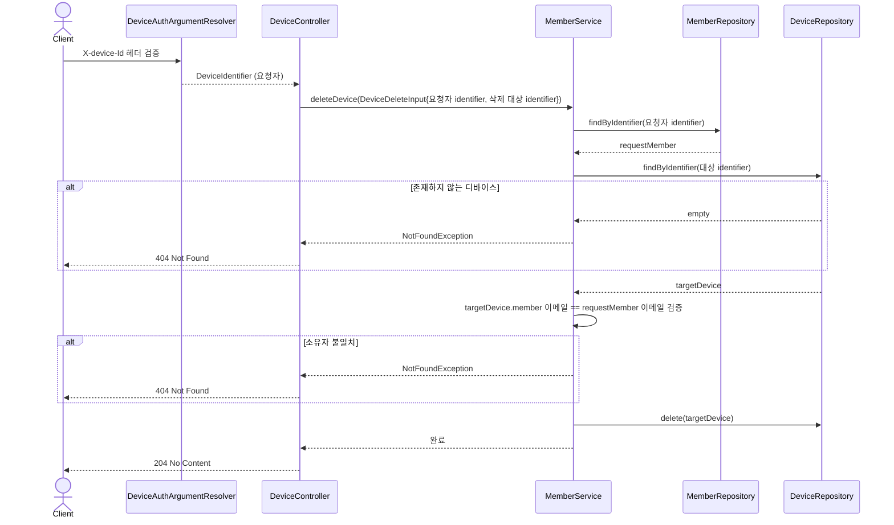

---

## 7. 커스텀 복습 주기 목록 조회

`GET /api/v1/cycles/custom`

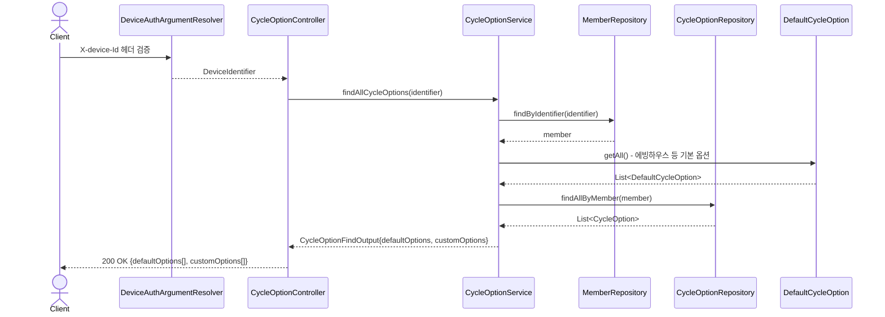

---

## 8. 커스텀 복습 주기 생성

`POST /api/v1/cycles/custom`

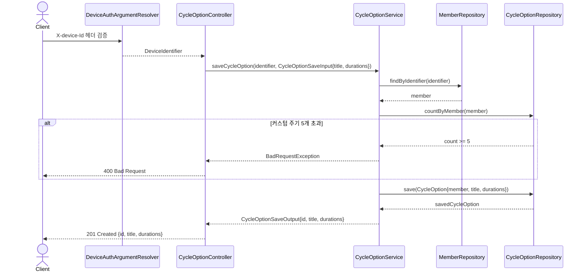

---

## 9. 커스텀 복습 주기 수정

`PUT /api/v1/cycles/custom/{id}`

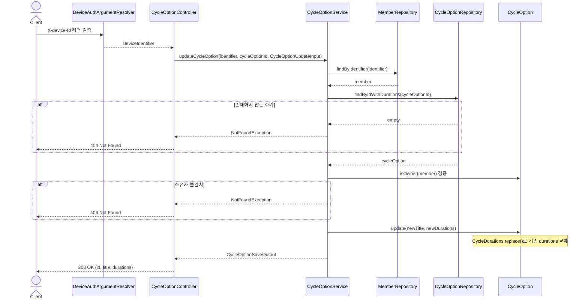

---

## 10. 커스텀 복습 주기 삭제

`DELETE /api/v1/cycles/custom/{id}`

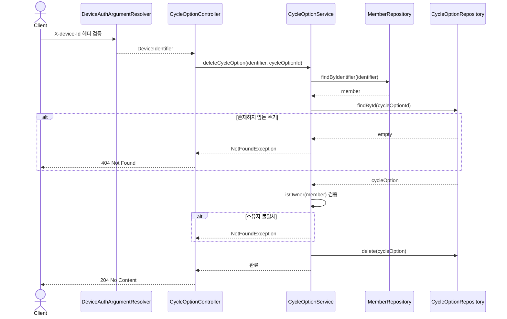

---

## 11. 복습 저장

`POST /api/v1/reviews`

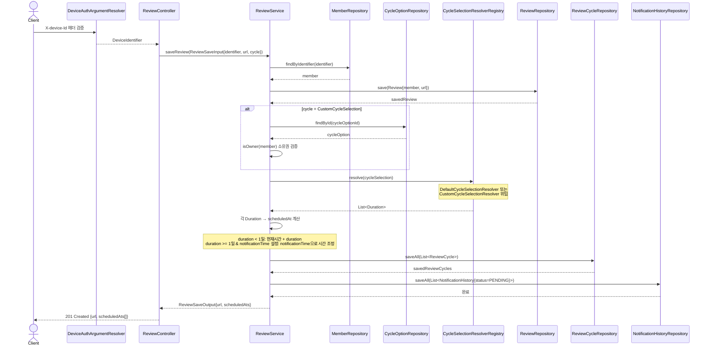

---

## 12. 복습 메일 발송 스케줄러

매 분 cron 실행 (`${schedule.review-mail.cron}`, Asia/Seoul 기준)

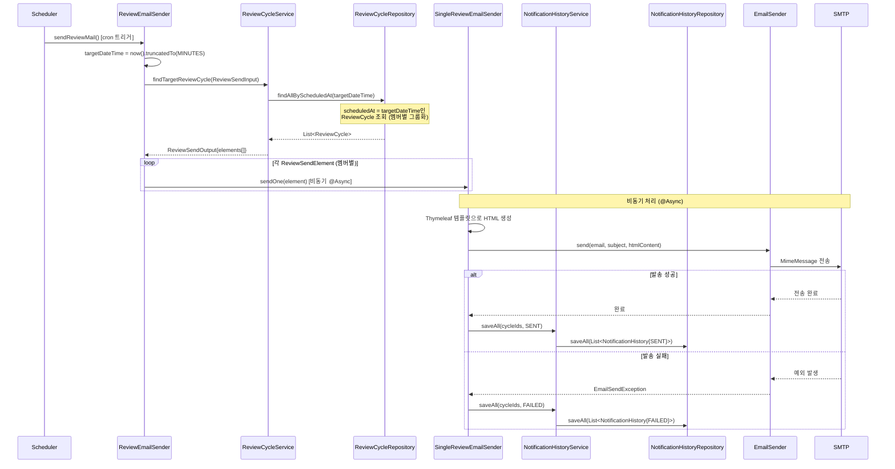

---

## 13. 실패 메일 재시도 스케줄러

60초마다 실행 (`fixedDelay = 60_000`)

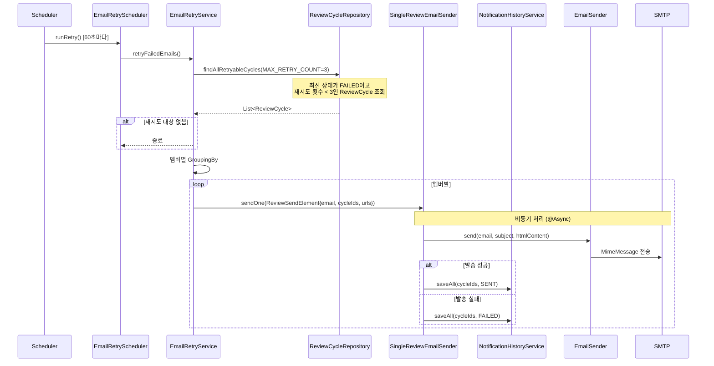

---

## 공통: 디바이스 인증 필터 (`@AuthDevice`)

모든 인증이 필요한 API에서 공통으로 동작하는 `DeviceAuthArgumentResolver` 흐름:

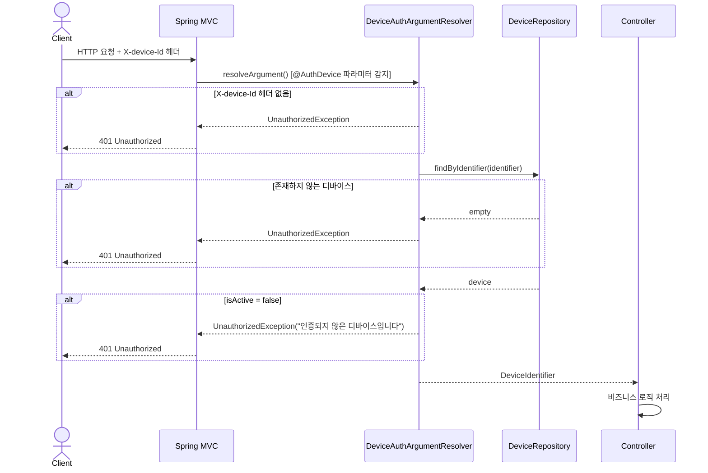

---

## 엔티티 관계 요약

```
Member (1) ──── (N) Device
Member (1) ──── (N) Review
Member (1) ──── (N) CycleOption

Review (1) ──── (N) ReviewCycle
ReviewCycle (1) ──── (N) NotificationHistory

CycleOption (1) ──── (N) CycleOptionDuration
```

## 알림 상태 흐름 (NotificationStatus)

```
PENDING → SENT    (발송 성공)
PENDING → FAILED  (발송 실패)
FAILED  → SENT    (재시도 성공)
FAILED  → FAILED  (재시도 실패, MAX 3회)
```