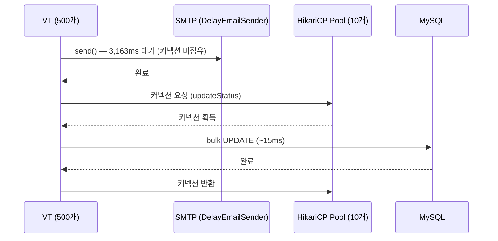
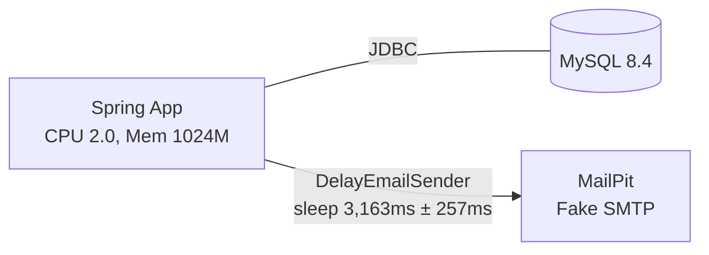

# 서론

## 검증 배경

이전 이메일 스케줄러 성능 테스트에서 세 가지 방식의 처리 성능을 비교하였습니다.

| 방식                       | 처리 시간  | 처리량     | 1분 이내   | 배율    |
|--------------------------|--------|---------|---------|-------|
| 기본값 (core-size=8)        | 200.6초 | 2.49건/초 | 3.3배 초과 | 1x    |
| 스레드 풀 튜닝 (core-size=27)  | 56.5초  | 8.85건/초 | 달성      | 3.6x  |
| Virtual Thread (Java 25) | 4.0초   | 125건/초  | 달성      | 50.2x |

Virtual Thread(VT) 전환으로 500건 처리 시간이 200.6초 → 4.0초로 개선되었습니다. 이 결과는 500개의 VT가 동시에 생성되어 각자 3.2초의 SMTP 대기를 병렬로 수행한 덕분입니다.

그런데 VT 적용으로 동시에 실행되는 작업 수가 8개(core-size=8) 또는 27개(core-size=27)에서 500개로 증가하였습니다. 동시 실행 작업이 늘어나면 DB에 동시 접근하는 스레드도 늘어납니다. HikariCP 기본값인 `maximumPoolSize=10`이 이 규모에서 커넥션 병목을 일으키는지 별도로 검증합니다.

# 1. 목표 정의

> VT 전환 후 HikariCP `maximumPoolSize=10`(기본값)이 커넥션 병목을 일으키는지 코드 분석과 실측으로 검증한다.

# 2. DB 커넥션 사용 패턴 분석

## 2-1. 코드 추적

이메일 발송 흐름에서 DB 커넥션이 어느 구간에서 사용되는지 코드에서 직접 확인하였습니다.

```
ReviewEmailSender.sendReviewMail()           @Scheduled
  ├─ reviewCycleService.findTargetReviewCycle()   @Transactional(readOnly) — 범위 조회
  └─ SingleReviewEmailSender.sendOne()            @Async, @Transactional 없음
       ├─ emailSender.send()                      Thread.sleep(3,163ms ± 257ms), DB 접근 없음
       └─ notificationHistoryService.updateStatus()   @Transactional
            └─ repository.updateStatus()              단일 bulk UPDATE IN 쿼리
```



## 2-2. 핵심 관찰: SMTP 대기 중 커넥션 미점유

`sendOne()`에 `@Transactional`이 없기 때문에 3.2초의 SMTP 대기 구간에서는 DB 커넥션을 점유하지 않습니다. 커넥션은 `updateStatus()` 호출 시점에만 획득되며 bulk UPDATE 1회 실행 후 즉시 커밋되고 반환됩니다.

이 패턴이 의미하는 바는 다음과 같습니다.

- 500개의 VT가 동시에 SMTP 대기 중이더라도 커넥션 경쟁이 없습니다.
- 커넥션 경쟁은 SMTP 대기가 끝난 뒤 `updateStatus()` 호출이 집중되는 시점에만 발생합니다.
- 커넥션 보유 시간이 ~15ms로 매우 짧아 풀 순환이 빠릅니다.

# 3. 이론값 계산

## 3-1. 커넥션 보유 시간 근거

커넥션 보유 시간 ~15ms는 VT 500건 테스트의 실측 오버헤드(800ms)를 라운드 수(50)로 나눈 역산값이다.

```
실측 오버헤드 800ms ÷ 50라운드 ≈ 16ms → "~15ms"
```

격리 측정(단일 호출, 경쟁 없음)을 수행하면 단건 UPDATE 특성상 더 낮은 값이 나올 수 있다.
여기서 15ms는 500-VT 동시 부하 조건에서의 유효 hold time으로 해석한다.

## 3-2. 커넥션 대기 이론값

```
VT 500개 동시 실행
→ updateStatus() 동시 호출 최대 500회
→ pool size = 10

대기 라운드 = 500 / 10 = 50라운드
커넥션 대기 이론값 = 50 × 15ms = 750ms
```

HikariCP `connectionTimeout` 기본값은 30,000ms입니다. 750ms는 이 값을 크게 밑돌므로 커넥션 획득 실패(timeout)는 발생하지 않습니다.

## 3-3. 예상 총 처리 시간

```
VT 총 처리 시간 ≈ SMTP 대기 + 커넥션 대기 오버헤드
               ≈ 3.2초      + 0.75초
               ≈ ~3.95초
```

# 4. 테스트 환경

| 항목 | 값 |
|------|----|
| Java | Amazon Corretto 25 (런타임) / Java 21 (컴파일) |
| Spring Boot | 3.5.x |
| `spring.threads.virtual.enabled` | `true` |
| HikariCP `maximumPoolSize` | 10 (기본값) |
| HikariCP `connectionTimeout` | 30,000ms (기본값) |
| `@Async` executor | `SimpleAsyncTaskExecutor` (VT 기반) |
| SMTP 시뮬레이션 | `DelayEmailSender` (`Thread.sleep(3,163ms ± 257ms)`) |
| DB | MySQL 8.4 |
| Spring 컨테이너 | CPU 2.0 cores, Memory 1024M |



> `DelayEmailSender` 선택 배경: Toxiproxy는 SMTP 패킷 단위로 지연을 주입하여 1건당 ~22초가 소요되는 측정 오류가 발생합니다. `DelayEmailSender`는 세션 단위 지연(실제 Gmail 실측 기반)을 정확히 재현합니다. 상세 내용은 `email-scheduler-performance-test.md` 4-2, 4-3장을 참고합니다.

# 5. 기준선 측정 (플랫폼 스레드)

비교 기준 확보를 위해 플랫폼 스레드 환경(`core-size=8`)의 결과를 정리합니다.

| 건수 | 처리 시간 | 처리량 (건/초) | 성공률 | executor |
|------|---------|-----------|------|---------|
| 50   | 20.3초   | 2.47      | 100% | PT `reviewEmailExecutor` (core-size=8) |
| 200  | 79.3초   | 2.52      | 100% | PT `reviewEmailExecutor` (core-size=8) |
| 500  | 200.6초  | 2.49      | 100% | PT `reviewEmailExecutor` (core-size=8) |

> 상세 데이터: `perftest/benchmark-results.json`

플랫폼 스레드 환경에서 `updateStatus()`의 동시 호출 수는 최대 8개(`core-size=8`)입니다. 이는 pool size 10보다 작으므로 커넥션 경쟁이 없습니다. 따라서 PT 환경에서는 DB 커넥션 풀이 병목 요인이 아닙니다.

# 6. VT 환경 측정

| 건수 | 처리 시간 | 처리량 (건/초) | 성공률 | executor |
|------|---------|-----------|------|---------|
| 500  | 4.0초    | 125.0     | 100% | `SimpleAsyncTaskExecutor` (VT) |

500개의 VT가 동시에 `Thread.sleep(~3.2초)`을 실행하고 이후 `updateStatus()`를 호출합니다. 실측 처리 시간 4.0초에서 SMTP 대기 3.2초를 제외한 실측 오버헤드는 약 0.8초입니다.

```
실측 오버헤드 = 4.0초 - 3.2초 = 0.8초
```

# 7. 이론값과 실측 대조

| 항목 | 이론값 | 실측 | 평가 |
|------|--------|------|------|
| SMTP 대기 시간 | 3.2초 | ~3.2초 | 일치 |
| 커넥션 대기 오버헤드 | 750ms | ~800ms | 오차 범위 내 일치 |
| VT 총 처리 시간 | ~3.95초 | 4.0초 | 일치 |

이론값(750ms)과 실측(~800ms)의 차이는 50ms 수준으로 JVM 스케줄링, GC, VT mount/unmount 오버헤드에 의한 정상 편차입니다. 커넥션 획득 실패(timeout)는 발생하지 않았으며 이론 모델이 실측을 잘 설명합니다.

# 8. 결론

## 현재 규모 판정

VT 500건 동시 실행 환경에서 HikariCP `maximumPoolSize=10`(기본값)은 병목이 아닙니다.

- 커넥션 대기 오버헤드 ~800ms는 전체 처리 시간 4.0초의 20%이며 허용 범위입니다.
- `connectionTimeout` 30,000ms 대비 실제 대기 750ms로 획득 실패 리스크가 없습니다.
- `sendOne()`의 `@Transactional` 부재로 SMTP 대기 3.2초 동안 커넥션을 점유하지 않는 구조가 핵심입니다.

## pool size 조정이 필요한 임계점

커넥션 대기 오버헤드가 허용 한계를 초과하는 시점은 다음 수식으로 추정합니다.

```
필요 pool size ≥ N / (SMTP_ms / updateStatus_ms)
              = N / (3,163 / 15)
              = N / 211
```

예를 들어 동시 처리 건수 N이 2,110건을 초과하면 pool size 10개로는 대기 라운드가 211라운드(~3.2초)가 되어 총 처리 시간이 2배 이상 증가합니다.

현재 목표 DAU ~500에서는 이 임계점에 도달하지 않습니다.

## 단계별 적용 계획과의 연계

`email-scheduler-performance-test.md` 9장의 단계별 적용 계획 기준입니다.

| 단계 | 방식 | 동시 updateStatus() 최대 호출 | pool size 10 충분 여부 |
|-----|-----|--------------------------|---------------------|
| 현재 | PT core-size=8 | 8개 | 충분 (경쟁 없음) |
| 1단계 | PT core-size=27 | 27개 | 충분 (경쟁 없음) |
| 2단계 | VT (500건) | 500개 | 충분 (0.75초 오버헤드, 허용) |

결론적으로, VT 전환 이후에도 현재 목표 DAU ~500 범위에서는 pool size 조정 없이 운영 가능합니다.

# 9. 추가 고려 사항

## 9-1. VT pinning — JDBC synchronized 블록

`spring.threads.virtual.enabled=true` 환경에서 JDBC 드라이버(MySQL Connector/J)가 내부적으로 `synchronized` 블록을 사용하면 VT가 carrier thread에 고정(pin)된다. Pin된 VT는 커넥션을 반환하지 못한 채 carrier thread를 점유하여 실질적인 동시성이 플랫폼 스레드 수준으로 저하된다.

- HikariCP 5.1.0+: synchronized 제거 완료 (Spring Boot 3.5.x 포함)
- MySQL Connector/J: 일부 경로에 synchronized 잔존 가능성 있음
- 탐지 방법: JVM 옵션 `-Djdk.tracePinnedThreads=full` 또는 JFR `jdk.VirtualThreadPinned` 이벤트
- 대응: Connector/J 버전 업그레이드 또는 pinning 발생 경로 회피

## 9-2. leakDetectionThreshold 미설정

HikariCP `leakDetectionThreshold`(기본값: 0, 비활성)가 설정되지 않으면 커넥션이 반환되지 않아도 경고 로그가 발생하지 않는다. VT 500개 동시 실행 환경에서 누수 탐지가 어려워진다.

- 권장: `spring.datasource.hikari.leak-detection-threshold=2000` (2,000ms)
- `updateStatus()` hold time ~15ms 대비 충분한 여유이므로 정상 흐름에서 경고가 발생하지 않음

## 9-3. 실 SMTP 환경에서의 분산 특성 차이

`DelayEmailSender`는 `Thread.sleep(3,163ms ± 257ms)` 균일 분포로 시뮬레이션한다. 실 SMTP(Gmail 등)는:

- 일부 세션에서 수십 초 지연 또는 타임아웃 발생 가능
- 지연이 분산되면 `updateStatus()` 호출 시점도 분산 → 커넥션 경쟁 완화
- 일부 세션이 타임아웃 후 재시도하면 집중 호출 발생 → 재시도 폭풍(retry storm) 가능성

재시도 로직(`EmailRetryScheduler`)이 별도 스케줄로 분리되어 있어 즉각적인 폭풍은 방지되나, 실 SMTP 도입 시 별도 부하 측정이 필요하다.

## 9-4. 다중 인스턴스 배포 시 DB 최대 연결 수

MySQL 기본 `max_connections=151`. 단일 인스턴스 pool size 10은 문제없으나, 수평 확장 시:

```
총 커넥션 수 = 인스턴스 수 × maximumPoolSize
예) 10 인스턴스 × 10 = 100 (여유 있음)
    20 인스턴스 × 10 = 200 → max_connections 초과
```

인스턴스 수 증가 시 `max_connections` 상향 또는 `maximumPoolSize` 축소 검토 필요.

## 9-5. 스케줄 중첩 실행 가능성

`@Scheduled`는 고정 지연(fixedDelay) 또는 cron 방식으로 동작한다. 현재 처리 시간 ~4초는 1분 주기 스케줄 내에서 충분히 완료되나, 처리 건수 증가로 처리 시간이 1분을 초과하면 다음 스케줄이 이전 실행과 중첩될 수 있다.

임계점(N > ~2,110건)에 도달하기 전에 재검토한다. 중첩 방지 필요 시 `@Scheduled(fixedDelay=...)` 또는 분산 락(Shedlock 등) 도입을 고려한다.
